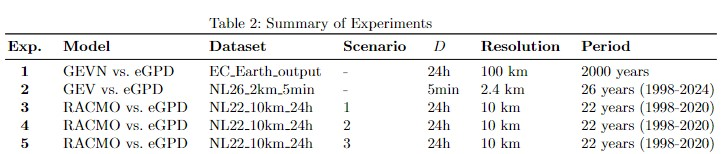
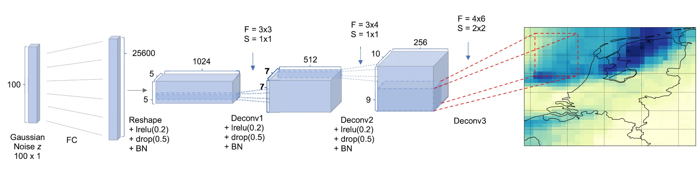
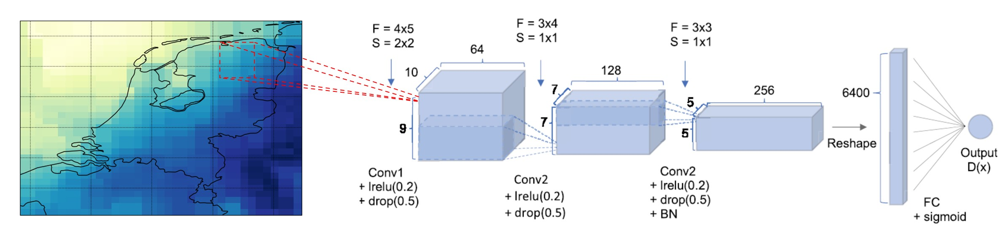

## Spatial-extremes
Models complex spatial dependencies between climate extremes in different locations. With evtGAN, we show that combining extreme value theory with a deep learning model (generative adversarial networks) can well represent complex spatial dependencies between extremes. Hence, instead of running expensive climate models, the approach can be used to sample many instances of spatially cooccurring extremes with realistic dependence structure, which may be used for climate risk modeling and stress testing of climate-sensitive systems.

Source: Application Paper: Boulaguiem et al. (2022) - Modeling and simulating spatial extremes by combining extreme value theory with generative adversarial networks.

### Experiments

## Architecture evtGAN

### Generator

### Discriminator

### commands lightning 
'unset GITHUB_TOKEN'
'git config --global user.name "remiverdiesen"'
'git config --global user.email "remi.verdiesen@hetnet.nl"'
'gh auth login'
'git clone https://github.com/remiverdiesen/spatial-extremes.git'